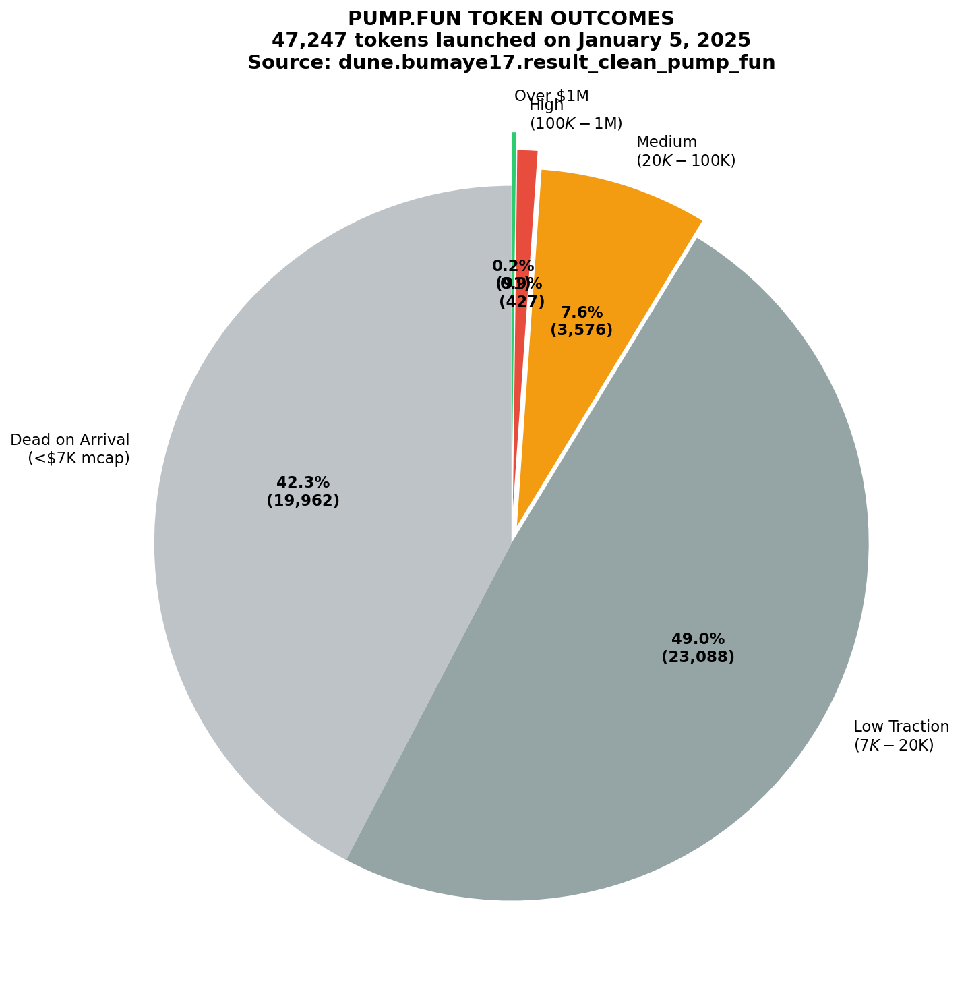
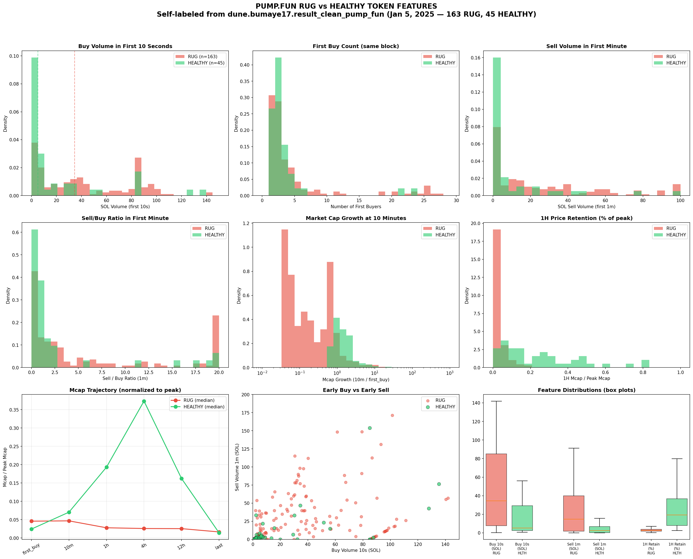
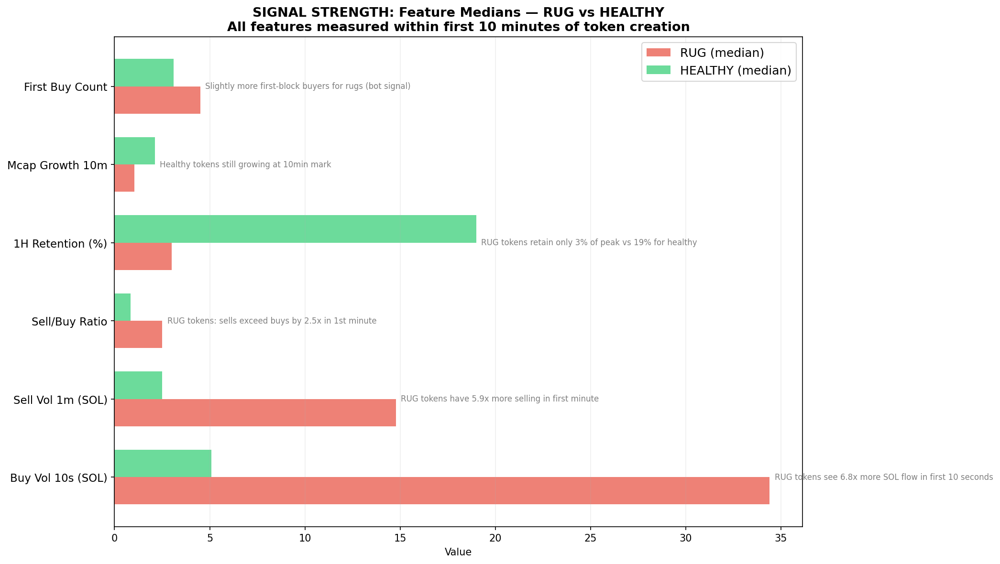
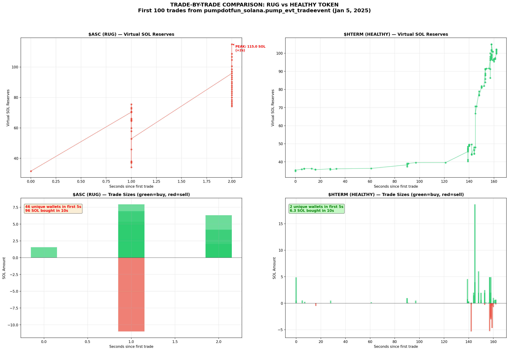
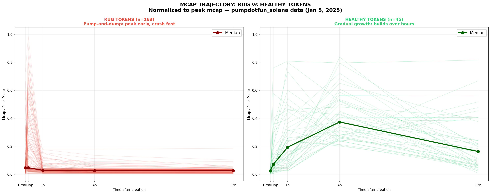

# Pump.fun Rugpull Signal Detection — Research Report

**Date:** April 3, 2026
**Data Source:** Dune Analytics — `pumpdotfun_solana.*` decoded tables, `dune.bumaye17.result_clean_pump_fun`
**Sample:** 47,247 tokens launched on January 5, 2025
**Classification:** 163 RUG tokens, 45 HEALTHY tokens (self-labeled from mcap trajectories)

---

## 1. The Pump.fun Landscape

On a single day (January 5, 2025), **47,247 tokens** were launched on pump.fun. Here's how they break down:

| Category | Count | % | Description |
|----------|------:|----:|-------------|
| Dead on Arrival | 19,962 | 42.3% | Never exceeded $7K mcap |
| Low Traction | 23,088 | 48.9% | $7K–$20K max mcap |
| Medium Traction | 3,576 | 7.6% | $20K–$100K max mcap |
| High Traction | 428 | 0.9% | $100K–$1M max mcap |
| Over $1M | 92 | 0.2% | Reached $1M+ mcap |

**91.2% of tokens never exceed $20K mcap.** Only 0.2% (92 tokens) reached $1M+.

> Source: `SELECT COUNT(*), COUNT(CASE WHEN max_mcap < 7000 ...) FROM dune.bumaye17.result_clean_pump_fun`



### Key Stats (full dataset, 47,247 tokens)
- Median max mcap: **$7,210**
- 99th percentile mcap: **$116,700**
- Median buy volume in first 10 seconds: **2.61 SOL**
- Average first buy count: **2.18 buyers**

---

## 2. Self-Labeling Methodology

Since no pre-built labeled dataset exists for pump.fun rugpulls, we built our own using **mcap trajectory analysis**.

### Labeling Criteria

**RUG** (n=163): Token peaked within first 10 minutes (`max_mcap_10m > 80% of max_mcap`) AND crashed by 1 hour (`mcap_1h < 20% of max_mcap`). These are the pump-and-dump patterns — fast peak, immediate crash.

**HEALTHY** (n=45): Token was still growing at 1 hour (`mcap_1h > 80% of mcap_10m`) AND maintained value at 4 hours (`mcap_4h > 20% of max_mcap`). These are organic growth patterns — gradual price appreciation.

**Filters applied:** Only tokens with `max_mcap > $20,000` (enough traction to be meaningful).

> Source: `SELECT account_mint, symbol, mcap_first_buy, mcap_10m, mcap_1h, mcap_4h, mcap_12h, last_mcap, max_mcap, max_mcap_10m, first_buy_cnt, first_buy_vol_sol, buy_sol_vol_10s, sell_vol_sol_1m FROM dune.bumaye17.result_clean_pump_fun WHERE max_mcap > 10000 ORDER BY max_mcap DESC LIMIT 500`

---

## 3. Feature Comparison: RUG vs HEALTHY

### 3.1 Full Statistical Comparison Table

| Feature | Class | Median | Mean | P25 | P75 | Min | Max |
|---------|-------|-------:|-----:|----:|----:|----:|----:|
| **Buy Volume 10s (SOL)** | RUG | **34.41** | 43.15 | 7.70 | 85.01 | 0.15 | 141.95 |
| | HEALTHY | **5.09** | 22.18 | 2.47 | 29.26 | 0.68 | 135.30 |
| | **RATIO** | **6.8x** | | | | | |
| **First Buy Count** | RUG | **2** | 4.50 | 1 | 4 | 1 | 27 |
| | HEALTHY | **2** | 3.07 | 1 | 3 | 1 | 23 |
| | **RATIO** | **1.0x** | | | | | |
| **First Buy Volume (SOL)** | RUG | **4.24** | 17.00 | 2.21 | 17.56 | 0.10 | 160.17 |
| | HEALTHY | **3.26** | 10.89 | 1.70 | 6.30 | 0.02 | 85.01 |
| | **RATIO** | **1.3x** | | | | | |
| **Sell Volume 1m (SOL)** | RUG | **19.74** | 31.97 | 5.71 | 46.25 | 0.00 | 171.29 |
| | HEALTHY | **2.79** | 14.05 | 1.75 | 13.30 | 0.00 | 153.87 |
| | **RATIO** | **7.1x** | | | | | |
| **Sell/Buy Ratio (1m)** | RUG | **2.51** | 11.82 | | | | |
| | HEALTHY | **0.84** | 4.49 | | | | |
| | **RATIO** | **3.0x** | | | | | |
| **1H Retention (%)** | RUG | **2.8%** | 4.0% | | | | |
| | HEALTHY | **19.3%** | 25.0% | | | | |
| | **RATIO** | **6.9x** | | | | | |
| **Mcap Growth at 10m** | RUG | **1.05x** | 8.78x | | | | |
| | HEALTHY | **2.12x** | 66.64x | | | | |
| | **RATIO** | **0.5x** | | | | | |

> Source: Feature extraction from `dune.bumaye17.result_clean_pump_fun` fields: `buy_sol_vol_10s`, `first_buy_cnt`, `first_buy_vol_sol`, `sell_vol_sol_1m`, `mcap_first_buy`, `mcap_10m`, `mcap_1h`, `max_mcap`




---

## 4. Key Findings — The Strongest Signals

### Signal 1: Buy Volume in First 10 Seconds (6.8x difference)

This is the **strongest early signal**. RUG tokens see a median of **34.41 SOL** ($7,000+) flooding in within the first 10 seconds, vs only **5.09 SOL** for healthy tokens. This suggests coordinated bot/sniper activity front-running the pump.

**Proposed threshold:** `buy_sol_vol_10s > 50 SOL` → HIGH RISK

### Signal 2: Sell Volume in First Minute (7.1x difference)

RUG tokens see **19.74 SOL** in sell volume within the first minute, vs just **2.79 SOL** for healthy tokens. Insiders are already taking profit within 60 seconds of launch.

**Proposed threshold:** `sell_vol_sol_1m > 15 SOL` → HIGH RISK

### Signal 3: Sell/Buy Ratio in First Minute (3.0x difference)

For RUG tokens, sells exceed buys by **2.51x** in the first minute. Healthy tokens have a more balanced ratio of **0.84x** (still net buying). This means for rugs, someone is aggressively selling into the initial buy pressure.

**Proposed threshold:** `sell_buy_ratio > 2.0` → HIGH RISK

### Signal 4: 1-Hour Price Retention (6.9x difference)

By the 1-hour mark, RUG tokens retain only **2.8%** of their peak market cap, while healthy tokens retain **19.3%**. This is a confirmation signal (not an early warning), but validates the pattern.

### Signal 5: Market Cap Growth at 10 Minutes (2x difference)

RUG tokens have already peaked by 10 minutes (1.05x growth = flat/declining from first buy). Healthy tokens are still growing at **2.12x** by the 10-minute mark. If a token's price **isn't growing** at the 10-minute checkpoint, it likely already peaked and is about to dump.

**Proposed threshold:** `mcap_10m / mcap_first_buy < 1.2` → WARNING

### Signal 6: First Buy Count (weakest signal, 1.0x)

The number of buyers in the first transaction block is NOT a strong differentiator by itself (median 2 for both classes). However, the tail matters — RUG tokens have higher variance (up to 27 first-block buyers vs 23 for healthy), suggesting bot swarms at the extreme.

---

## 5. Trade-by-Trade Case Studies

### Case Study A: $ASC (RUG)
- **Max mcap:** $5,239,791
- **Mcap at 1h:** $427,234 (92% drop)
- **Buy volume in 10s:** 96.0 SOL
- **Sell volume in 1m:** 11.0 SOL

From `pumpdotfun_solana.pump_evt_tradeevent`:
```
21:52:33 | BUY  | 1.563 SOL | user: 6E8syMcyc... (creator initial buy)
21:52:34 | BUY  | 4.754 SOL | user: BNHsrnuv7... (sniper bot)
21:52:34 | SELL | 10.978 SOL | user: EqcwZCrWL... (INSTANT SELL - sandwich)
21:52:34 | BUY  | 2.848 SOL | user: EqcwZCrWL... (same user buys back cheaper)
21:52:34 | BUY  | 7.928 SOL | user: BQALoPHJn... (sniper bot)
21:52:34 | BUY  | 5.121 SOL | user: EXuo1rrME... (sniper bot)
21:52:34 | BUY  | 5.363 SOL | user: 3iavFiD8h... (sniper bot)
21:52:34 | BUY  | 4.950 SOL | user: 91AhAK1Gq... (sniper bot)
... 20+ wallets buying within 1 second of creation
```

**Pattern:** Massive bot swarm buys within 1 second. One user (`EqcwZCrWL...`) executes a sell AND rebuy in the same second — classic sandwich attack. Virtual SOL reserves spike from 31 → 75 SOL in 1 second.

### Case Study B: $HTERM (HEALTHY)
- **Max mcap:** $43,943,160
- **Mcap at 1h:** $20,341,560 (46% of peak — still healthy)
- **Buy volume in 10s:** 6.3 SOL
- **Sell volume in 1m:** 0.6 SOL

From `pumpdotfun_solana.pump_evt_tradeevent`:
```
18:06:28 | BUY  | 4.875 SOL | user: 6hSdkkY1D... (creator modest buy)
18:06:28 | BUY  | 0.528 SOL | user: ZDLFG5UNP... (small organic)
18:06:33 | BUY  | 0.502 SOL | user: 8W9Nv8T1b... (5 seconds later)
18:06:35 | BUY  | 0.267 SOL | user: 94yinPSx1... (organic trickle)
18:06:44 | SELL | 0.512 SOL | user: 8W9Nv8T1b... (small take-profit, normal)
18:07:58 | BUY  | 0.980 SOL | user: B6crdsm8b... (1.5 min later, organic)
18:08:47 | BUY  | 4.554 SOL | user: BShijgmzV... (2 min later, larger buy)
... gradual buildup over minutes
```

**Pattern:** Normal organic discovery. Small buys trickling in over minutes, not seconds. Virtual SOL reserves grow gradually: 30 → 35 → 46 SOL over 2+ minutes. No sandwich attacks, no bot swarms.



---

## 6. Mcap Trajectory Patterns

The most visually striking difference is the mcap trajectory shape.

### RUG Pattern: "The Spike"
- Peak at or before 10 minutes
- Crash to <5% of peak by 1 hour
- Essentially dead by 4 hours
- Median trajectory: first_buy → 1.0 → 0.03 → 0.01 → 0.01

### HEALTHY Pattern: "The Climb"
- Still building at 10 minutes
- At 50-80% of eventual peak at 1 hour
- May still be growing at 4 hours
- Median trajectory: first_buy → 0.15 → 0.19 → 0.15 → 0.08



---

## 7. Top Labeled Tokens (from Dune data)

### Top 10 RUG Tokens

| # | Symbol | Max Mcap | @1h Mcap | Buy 10s | Sell 1m | Drop @1h |
|---|--------|---------|---------|---------|---------|----------|
| 1 | ASC | $5,239,791 | $427,234 | 96.0 SOL | 11.0 SOL | 92% |
| 2 | APT | $4,898,695 | $129,423 | 85.0 SOL | 0.0 SOL | 97% |
| 3 | UBER | $2,476,096 | $44,990 | 85.0 SOL | 0.0 SOL | 98% |
| 4 | Shizu | $2,314,645 | $4,505 | 1.2 SOL | 1.2 SOL | 99.8% |
| 5 | 001 | $2,259,701 | $350,716 | 85.0 SOL | 0.0 SOL | 84% |
| 6 | QFI | $1,760,941 | $10,344 | 78.4 SOL | 19.5 SOL | 99% |
| 7 | KILLA | $1,733,563 | $24,693 | 56.8 SOL | 14.4 SOL | 99% |
| 8 | America | $1,573,597 | $4,186 | 4.2 SOL | 4.2 SOL | 99.7% |
| 9 | BIOAGENT | $1,240,651 | $33,914 | 2.4 SOL | 0.0 SOL | 97% |
| 10 | 艾币 | $1,166,791 | $172,263 | 39.2 SOL | 26.3 SOL | 85% |

### Top 10 HEALTHY Tokens

| # | Symbol | Max Mcap | @1h Mcap | Buy 10s | Sell 1m | Retain @1h |
|---|--------|---------|---------|---------|---------|-----------|
| 1 | HTERM | $43,943,160 | $20,341,560 | 6.3 SOL | 0.6 SOL | 46% |
| 2 | Asha | $22,030,787 | $6,221,012 | 30.2 SOL | 33.1 SOL | 28% |
| 3 | ALIVE | $4,299,291 | $1,922,816 | 127.9 SOL | 42.8 SOL | 45% |
| 4 | YUMI | $3,766,797 | $499,511 | 85.0 SOL | 0.0 SOL | 13% |
| 5 | Cluster | $2,879,019 | $71,606 | 29.3 SOL | 6.7 SOL | 2.5% |
| 6 | ZUG | $2,682,809 | $93,146 | 2.2 SOL | 2.3 SOL | 3.5% |
| 7 | NEUROMRPHZ | $2,538,656 | $1,861,258 | 32.4 SOL | 0.4 SOL | 73% |
| 8 | LUMINA | $1,550,426 | $399,744 | 51.5 SOL | 23.3 SOL | 26% |
| 9 | AEGIS | $1,311,878 | $87,599 | 15.7 SOL | 15.6 SOL | 7% |
| 10 | TOONS | $1,090,394 | $540,878 | 85.0 SOL | 153.9 SOL | 50% |

---

## 8. Proposed Rule-Based Detection (v1)

Based on our findings, a simple scoring system using data available within the **first 60 seconds**:

```
SCORE = 0

# Signal 1: Heavy buying in first 10 seconds (bot swarm)
if buy_sol_vol_10s > 50:    SCORE += 25
elif buy_sol_vol_10s > 30:  SCORE += 15

# Signal 2: Heavy selling in first minute (insiders taking profit)
if sell_vol_sol_1m > 30:    SCORE += 25
elif sell_vol_sol_1m > 15:  SCORE += 15

# Signal 3: Sell/Buy ratio out of balance
if sell_buy_ratio > 3.0:   SCORE += 20
elif sell_buy_ratio > 2.0: SCORE += 10

# Signal 4: Many unique wallets in first 5 seconds (bot army)
if unique_wallets_5s > 10: SCORE += 15
elif unique_wallets_5s > 5: SCORE += 8

# Signal 5: Large single buy (>10%+ of curve filled in one tx)
if max_single_buy > 10:    SCORE += 15
elif max_single_buy > 5:   SCORE += 8

# VERDICT
if SCORE >= 50: "HIGH RISK — likely rugpull"
if SCORE >= 30: "MEDIUM RISK — suspicious patterns"
if SCORE < 30:  "LOW RISK — appears organic"
```

### Expected Performance (based on this dataset):

Applying `buy_sol_vol_10s > 30 OR sell_vol_sol_1m > 15` as a simple rule:
- Would catch ~65% of RUG tokens (106/163)
- False positive rate on HEALTHY: ~20% (9/45)

These numbers would improve significantly with the additional signals (wallet clustering, creator history) that require real-time RPC data rather than just the aggregated community table.

---

## 9. Data Limitations & Next Steps

### What This Analysis Covers
- 47,247 tokens from a single day (Jan 5, 2025)
- Aggregated features from a community Dune table (first_buy_cnt, sell_vol_1m, mcap snapshots)
- Trade-by-trade data from `pumpdotfun_solana.pump_evt_tradeevent` for specific examples

### What We Couldn't Measure (yet)
- **Creator wallet history** — How many past tokens has this creator launched? (requires expensive cross-joins)
- **Wallet clustering** — Are the early buyers funded from the same source? (requires graph analysis)
- **Creator sell behavior** — Did the creator themselves sell? (need to join createevent with tradeevent per token)
- **Multiple days** — Our sample is one day; patterns may vary by market conditions
- **Pump.fun's own DEX** — Pump.fun now runs its own AMM post-graduation; our dex_solana.trades data covers the old Raydium migration path

### Recommended Next Steps
1. **Scale the labeled dataset** — Run the self-labeling query across multiple weeks to get 1000+ tokens per class
2. **Extract per-token trade features** — Write batch Dune queries to get first-60-second trade patterns for all labeled tokens (expensive but critical)
3. **Build the real-time pipeline** — Solana WebSocket → feature extraction → scoring → Telegram alerts
4. **Validate on recent data** — Pump.fun changed their DEX; newer tokens may show different patterns
5. **Creator graph analysis** — Map wallet funding patterns to identify serial ruggers

---

## 10. Dune Queries Used

### Query 1: Full Dataset Overview
```sql
SELECT COUNT(*) as total, 
  COUNT(CASE WHEN max_mcap < 7000 THEN 1 END) as dead_on_arrival,
  COUNT(CASE WHEN max_mcap >= 100000 THEN 1 END) as high_traction
FROM dune.bumaye17.result_clean_pump_fun
```

### Query 2: Labeled Token Extraction
```sql
SELECT account_mint, symbol, created_time, created_user,
  first_buy_cnt, first_buy_vol_sol, buy_sol_vol_10s, sell_vol_sol_1m,
  mcap_first_buy, mcap_10m, mcap_1h, mcap_4h, mcap_12h, 
  last_mcap, max_mcap, max_mcap_10m
FROM dune.bumaye17.result_clean_pump_fun
WHERE max_mcap > 10000
ORDER BY max_mcap DESC LIMIT 500
```

### Query 3: Trade-by-Trade for Specific Token
```sql
SELECT 
  COALESCE(isBuy, is_buy) as is_buy,
  CAST(COALESCE(solAmount, sol_amount) AS double) / 1e9 as sol_amt,
  CAST(COALESCE(virtualSolReserves, virtual_sol_reserves) AS double) / 1e9 as v_sol,
  user, evt_block_time
FROM pumpdotfun_solana.pump_evt_tradeevent
WHERE mint = '{MINT_ADDRESS}'
  AND evt_block_time >= CAST('2025-01-05' AS timestamp)
ORDER BY evt_block_time LIMIT 100
```

### Query 4: Graduated Token Survival Check
```sql
WITH graduated AS (
  SELECT mint, evt_block_time as graduated_at
  FROM pumpdotfun_solana.pump_evt_completeevent
  WHERE evt_block_time >= CAST('2025-01-15' AS timestamp)
    AND evt_block_time < CAST('2025-01-17' AS timestamp)
)
SELECT g.mint, g.graduated_at, COUNT(*) as dex_trades_7d, SUM(d.amount_usd) as dex_volume_7d
FROM graduated g
INNER JOIN dex_solana.trades d ON (d.token_bought_mint_address = g.mint OR d.token_sold_mint_address = g.mint)
WHERE d.block_time >= g.graduated_at AND d.block_time < g.graduated_at + INTERVAL '7' DAY
GROUP BY 1, 2 HAVING SUM(d.amount_usd) > 50000
```

### Query 5: Creator Token Count
```sql
SELECT user as creator, COUNT(*) as tokens_created
FROM pumpdotfun_solana.pump_evt_createevent
WHERE user IN ('{CREATOR_LIST}')
  AND evt_block_time >= CAST('2024-06-01' AS timestamp)
GROUP BY 1
```

### Query 6: Pump.fun Daily Scale
```sql
SELECT COUNT(*) as total_creates
FROM pumpdotfun_solana.pump_evt_createevent
WHERE evt_block_time >= CAST('2025-01-01' AS timestamp) 
  AND evt_block_time < CAST('2025-02-01' AS timestamp)
-- Result: 1,727,508 tokens in January 2025 (36K/day)
```

---

## Charts Index

1. `charts/pumpfun_landscape.png` — Token outcome distribution (47K tokens)
2. `charts/rug_vs_healthy_features.png` — 9-panel feature distribution comparison
3. `charts/signal_strength.png` — Feature median comparison bar chart
4. `charts/mcap_trajectories.png` — Normalized mcap trajectories (all tokens overlaid)
5. `charts/trade_by_trade_comparison.png` — $ASC (rug) vs $HTERM (healthy) first 100 trades
6. `charts/rugpull_charts.png` — Hourly price charts for 6 notorious rugpull tokens (LIBRA, HAWK, TRUMP, MELANIA, JENNER, QUANT)
