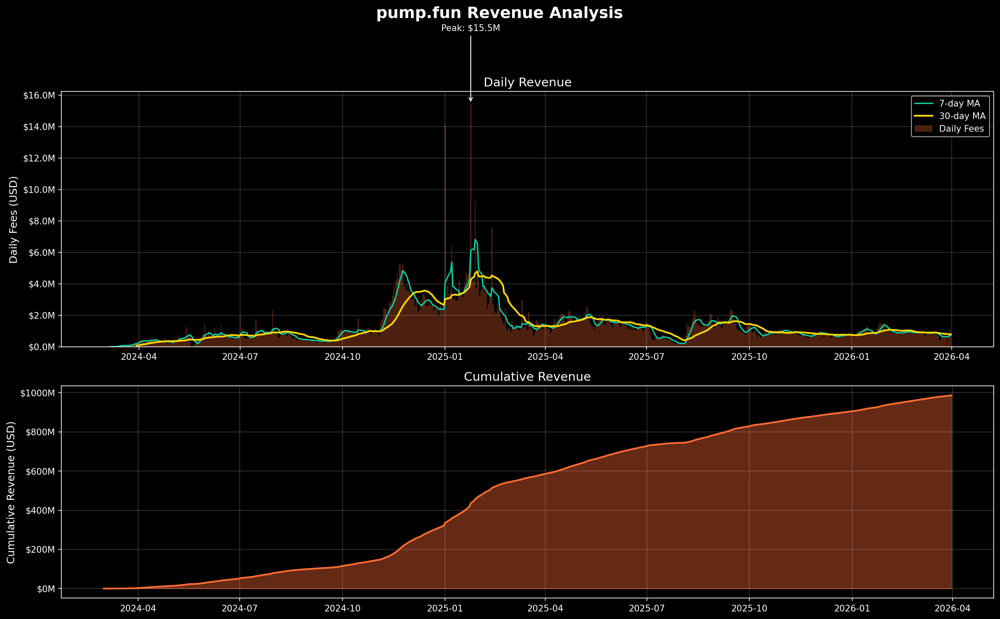
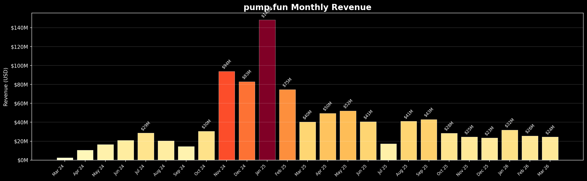
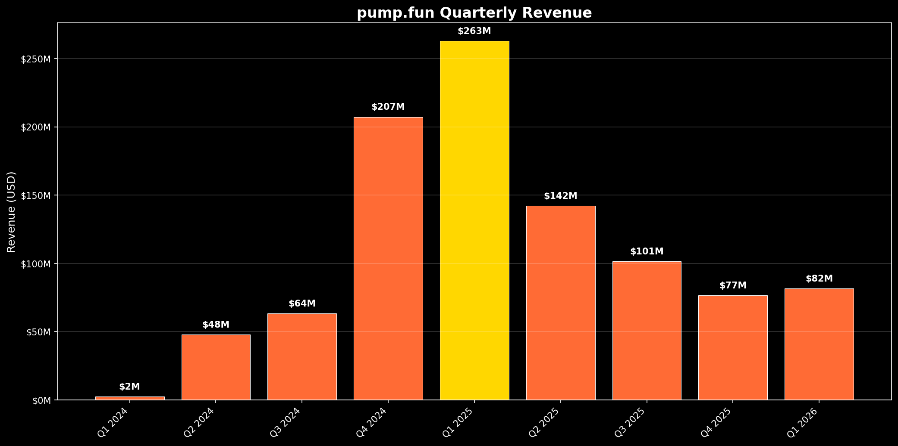
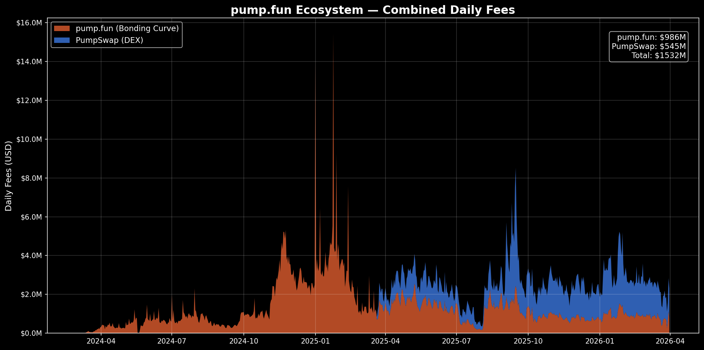
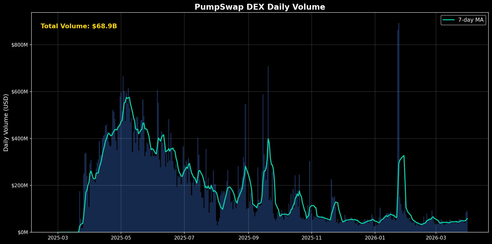
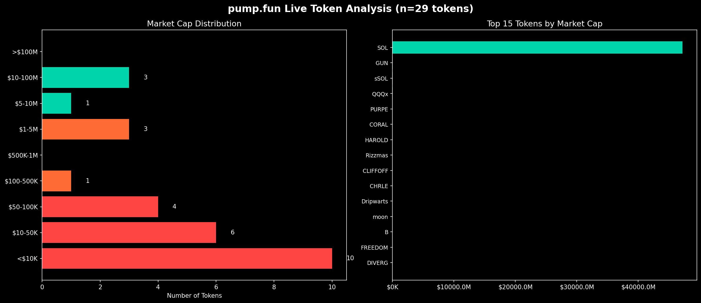

# Pump.fun: The Billion-Dollar Memecoin Factory

### A Comprehensive Analysis of Solana's Most Controversial Protocol

---

## 1. Executive Summary

Pump.fun is a Solana-based token launchpad that has redefined permissionless token creation, enabling anyone to deploy a memecoin in seconds for less than $2. Since its January 2024 launch, the platform — operated by fewer than 10 employees — has generated over **$1.02 billion in cumulative revenue**, launched **17.5 million tokens**, and captured up to **98% of memecoin market share** on Solana. It has since vertically integrated by launching its own DEX (PumpSwap) and conducted a **$1.32 billion ICO** completed in just 12 minutes. However, the platform remains deeply controversial: research indicates **98% of tokens launched are scams**, only **0.4% of users are profitable**, and the protocol has faced exploits, lawsuits, and regulatory scrutiny. Pump.fun represents a case study in the tension between permissionless innovation and consumer protection in crypto.

---

## 2. What is Pump.fun?

### Overview

Pump.fun is a **permissionless token launchpad** on Solana that drastically lowers the barrier to creating and trading new tokens. Before pump.fun, launching a token required technical knowledge, liquidity provisioning, and DEX listing coordination. Pump.fun reduced this to a single transaction.

### Key Facts

| Attribute | Detail |
|---|---|
| **Launch Date** | January 2024 |
| **Founders** | English entrepreneurs (pseudonymous) |
| **Blockchain** | Solana |
| **Employees** | < 10 |
| **Tokens Launched** | ~17.5 million |
| **Cumulative Revenue** | $1.02 billion+ |
| **Token Creation Cost** | ~0.02 SOL (~$2) |

### How It Works — Simplified Flow

```
┌─────────────┐     ┌──────────────────┐     ┌─────────────────┐     ┌──────────────┐
│  Creator     │────>│  Pump.fun        │────>│  Bonding Curve   │────>│  Graduation  │
│  launches    │     │  deploys token   │     │  trading phase   │     │  to DEX      │
│  token       │     │  on Solana       │     │  (~$69K mcap)    │     │  (PumpSwap)  │
└─────────────┘     └──────────────────┘     └─────────────────┘     └──────────────┘
       │                     │                        │                       │
       │              1% creation fee           1% trading fee          Migration fee
       │                     │                        │                       │
       └─────────────────────┴────────────────────────┴───────────────────────┘
                                         │
                                    Revenue to
                                    Pump.fun
```

### The Lifecycle of a Pump.fun Token

1. **Creation** — User sets name, ticker, image, description. Token is minted on Solana.
2. **Bonding Curve Phase** — Token trades on an internal automated market maker (AMM). Price rises along a mathematically defined curve as more SOL is deposited.
3. **Graduation** — When the bonding curve fills (~85 SOL deposited, ~$69K market cap), liquidity is automatically migrated to a DEX.
4. **Open Market** — Token trades freely on PumpSwap (formerly Raydium) with full liquidity.

---

## 3. How The Bonding Curve Works

### The Mathematical Model

Pump.fun uses a **constant-product bonding curve** (x × y = k) with **virtual reserves** to ensure a non-zero starting price. This is mathematically identical to Uniswap V2's CPAMM formula, but applied in a fundamentally different context: instead of a real liquidity pool with deposited assets on both sides, pump.fun creates a synthetic pool seeded with "virtual" SOL that doesn't actually exist. This lets every token start trading from zero real liquidity while still having a well-defined price curve.

#### Initial Parameters

| Parameter | Value |
|---|---|
| **Virtual SOL Reserve** | 30 SOL |
| **Virtual Token Reserve** | 1,073,000,000 tokens (1.073B) |
| **Total Token Supply** | 1,000,000,000 tokens (1B) |
| **Real Tokens in Curve** | ~793,100,000 tokens |
| **Constant Product (k)** | 30 × 1,073,000,000 = 32,190,000,000 |
| **Graduation Threshold** | ~85 SOL real deposited (~115 SOL virtual) |

#### The Price Formula

At any point during the bonding curve:

```
Price = Virtual SOL Reserve / Virtual Token Reserve

Starting price:
  P₀ = 30 / 1,073,000,000 = 0.00000002796 SOL per token

To buy Δ tokens:
  Cost (in SOL) = k / (token_reserve - Δ) - sol_reserve
  
  Where:  k = sol_reserve × token_reserve
```

#### Price Progression Example

| SOL Deposited (Real) | Virtual SOL | Tokens Remaining | Price per Token (SOL) | Approx Market Cap |
|---|---|---|---|---|
| 0 | 30 | 1,073,000,000 | 0.0000000280 | $4,000 |
| 10 | 40 | 804,750,000 | 0.0000000497 | $7,100 |
| 25 | 55 | 585,272,727 | 0.0000000940 | $13,400 |
| 50 | 80 | 402,375,000 | 0.0000001989 | $28,400 |
| 85 | 115 | 279,913,043 | 0.0000004109 | $69,000 |

#### Key Insight

> The curve creates a **~14.7x price increase** from start to graduation. Early buyers get significantly better prices, creating strong FOMO dynamics. The virtual reserves ensure the price is never zero, preventing division-by-zero errors and ensuring the first buyer always pays a real price.

#### Why Every Token Graduates at the Same Price

Because every token launches with identical parameters — same virtual reserves, same supply, same curve shape — every single token that reaches graduation does so at the exact same price (~0.000000411 SOL/token) and the same market cap (~$69K). This is a deliberate design choice: it removes complexity, makes progress universally comparable, and prevents manipulation through custom curve parameters.

#### The Graduation Price Discontinuity

An important subtlety: the virtual_sol = 30 parameter was precisely calculated to minimize price disruption at graduation. For zero fees, the bonding curve price and the PumpSwap pool price would be nearly identical (the virtual token reserve of 1,073,000,000 is within 43,231 tokens of the mathematically perfect value). However, pump.fun takes ~6 SOL in migration fees, creating approximately a 7% price drop at the moment of graduation. This gap is a deliberate business decision — it's how the protocol monetizes graduation — not a design flaw.

#### What Happens at Graduation

When ~85 real SOL has been deposited:
- ~793.1M tokens have been purchased from the curve (users hold them)
- ~206.9M tokens remain — these were **never on the bonding curve**. They were set aside from creation specifically for LP seeding.
- ~79 SOL (after fees) + 206.9M reserved tokens → PumpSwap LP pool
- **LP tokens are burned** — the liquidity is permanently locked. No one (not pump.fun, not the creator, not anyone) can ever withdraw it. This eliminates the most common rug pull vector in DeFi: pulling LP.

> **Note:** LP token burning prevents liquidity removal but does NOT prevent other scams like creator token dumps, insider sniping, or coordinated pump-and-dumps.

---

## 4. The Revenue Machine

### $1 Billion+ in Under 18 Months

Pump.fun is possibly the **most revenue-efficient company in crypto history** on a per-employee basis. The charts below tell the story of how a sub-10 person team built a billion-dollar revenue engine.

#### Revenue Streams

| Revenue Source | Fee | Description |
|---|---|---|
| **Trading Fee (Bonding Curve)** | 1% per trade | Applied during the bonding curve phase |
| **Token Creation Fee** | ~0.02 SOL | Nominal fee for minting |
| **Migration Fee** | ~1.5 SOL | Fee upon graduation to DEX |
| **PumpSwap Trading Fee** | 0.25% | Post-graduation trading (launched Mar 2025) |

### The Revenue Story in Data

The following chart shows pump.fun's daily revenue alongside its cumulative total. Two things jump out: the extraordinary volatility of daily income (driven by memecoin mania cycles), and the relentless upward march of cumulative revenue that crossed $1 billion by early 2026.



The daily revenue chart reveals the "memecoin supercycle" of late 2024 to early 2025 in vivid detail. Revenue was near-negligible for the first several months after launch, then exploded to a **peak of $15.5M in a single day** in January 2025 — coinciding with peak memecoin mania on Solana. The 30-day moving average smooths through the noise and shows the true trend: a dramatic spike followed by a gradual settling to a sustainable baseline of $1-3M/day. Even at this "cool-down" level, the platform generates tens of millions per month.

The cumulative revenue curve (bottom panel) is perhaps more telling. The steep inflection point around November 2024 shows when pump.fun transitioned from a niche experiment to a money-printing machine. Even after daily revenue cooled, the cumulative line kept climbing steadily — the platform had found a sustainable floor.

### Monthly Revenue Breakdown

Breaking the revenue into monthly buckets makes the boom-and-bust cycle even more legible:



The color gradient (pale yellow to deep red) maps directly to revenue intensity. The platform started with near-zero revenue in March 2024, gradually built through the summer, then detonated in Q4 2024. **January 2025 was the all-time peak at ~$148M in a single month** — nearly $5M per day on average. The subsequent decline was sharp but stabilized around $20-40M/month, a level that would be the envy of most crypto companies. By March 2026, monthly revenue sat at ~$24M — still generating nearly $300M annually from a team of fewer than 10 people.

### Quarterly Revenue Trajectory

Zooming out further to quarterly view reveals the macro trajectory:



The quarterly lens tells the cleanest story: **pump.fun went from $2M in Q1 2024 to $263M in Q1 2025 — a 131x increase in four quarters.** The subsequent correction brought quarterly revenue down to $77M by Q4 2025, but the slight uptick to $82M in Q1 2026 suggests the platform may be finding a stable floor. At ~$80M/quarter (~$320M annualized), pump.fun remains one of the highest-revenue protocols in all of crypto.

#### Revenue Milestones

| Date | Milestone | Timeframe |
|---|---|---|
| Jan 2024 | Launch | — |
| Oct 2024 | $100M cumulative revenue | ~9 months |
| Nov 2024 | $200M cumulative revenue | +1 month |
| Jan 2025 | $400M cumulative revenue | +2 months |
| Mar 2025 | $500M+ | PumpSwap launch |
| Mid-2025 | **$1.02B cumulative** | ~18 months |

#### Key Revenue Metrics

```
┌─────────────────────────────────────────────────────┐
│                                                     │
│   Peak Daily Revenue:          $15.5M               │
│   Cumulative Revenue:          $1.02B+              │
│   Employees:                   < 10                 │
│   Revenue per Employee:        $100M+               │
│   Token Buybacks:              $323.4M              │
│                                                     │
└─────────────────────────────────────────────────────┘
```

#### Revenue Per Employee Comparison

| Company | Employees | Revenue | Rev/Employee |
|---|---|---|---|
| **Pump.fun** | ~10 | $1.02B | **~$102M** |
| Coinbase | ~3,400 | $6.6B | ~$1.9M |
| Uniswap Labs | ~100 | ~$100M | ~$1M |
| OpenSea | ~200 | ~$300M (peak) | ~$1.5M |

> Pump.fun generates roughly **50-100x** the revenue per employee compared to major crypto companies.

---

## 5. The Vertical Integration: PumpSwap

### From Revenue Leak to Revenue Capture

Perhaps the most strategically significant move in pump.fun's history was the launch of **PumpSwap** in March 2025. Before PumpSwap, every token that graduated from the bonding curve migrated to Raydium — meaning all post-graduation trading fees (often the most lucrative phase for successful tokens) went to a competitor.

```
BEFORE (Jan 2024 – Mar 2025):
  Pump.fun (token creation) ──graduation──> Raydium (DEX trading)
  
  Revenue: Only bonding curve fees (~$0-69K market cap range)

AFTER (Mar 2025 – Present):
  Pump.fun (token creation) ──graduation──> PumpSwap (own DEX)
  
  Revenue: Bonding curve fees + ALL post-graduation trading fees
```

### The Combined Fee Picture

The following chart is one of the most important in this entire analysis. It shows the stacked daily fees from both the bonding curve (orange) and PumpSwap DEX (blue), revealing how the revenue composition evolved:



Several critical insights emerge from this chart:

**1. PumpSwap transformed the revenue model.** Before April 2025, all revenue came from bonding curve fees (orange only). After PumpSwap launched, a second revenue layer appeared (blue). By late 2025, PumpSwap fees frequently equaled or exceeded bonding curve fees on any given day.

**2. The cumulative numbers are staggering.** The summary box shows $986M from bonding curve fees and $545M from PumpSwap — a combined **$1.53 billion** in total ecosystem fees. PumpSwap alone generated over half a billion dollars in roughly one year of operation.

**3. Revenue diversification creates resilience.** The secondary peak around October 2025 (~$8.5M combined daily) was driven largely by DEX trading activity, not new token launches. This means pump.fun now earns significant revenue even when the pace of new token creation slows — a crucial evolution from its earlier model where revenue was entirely dependent on new launches.

**4. The steady state is impressive.** By early 2026, combined daily fees settled around $3-4M with a roughly even split between bonding curve and DEX fees. This ~$1B+ annualized run rate — from a team of fewer than 10 — remains extraordinary.

### PumpSwap Volume Growth

The raw trading volume on PumpSwap tells the story of rapid adoption followed by market normalization:



PumpSwap went from zero to **$400-600M in daily volume within its first two months** — a staggering adoption curve that validated pump.fun's bet on vertical integration. The total cumulative volume reached **$68.9 billion** in roughly 13 months. The 7-day moving average peaked near $600M/day in May 2025 before gradually declining through the second half of the year. Notable features include a massive single-day spike to ~$900M in February 2026 (likely driven by a viral memecoin event), and a stabilization around $50-100M/day by early 2026.

The decline from peak is not necessarily bearish — it mirrors the broader cooling of memecoin mania. The consistent $50-100M daily baseline represents genuine sustained demand, and the platform retains a built-in moat: every new token that graduates from pump.fun's bonding curve automatically lands on PumpSwap, providing a continuous stream of new trading pairs.

---

## 6. The Contract Architecture

### Solana Program IDs

| Program | Address | Purpose |
|---|---|---|
| **Pump (Original)** | `6EF8rrecthR5Dkzon8Nwu78hRvfCKubJ14M5uBEwF6P` | Bonding curve AMM, token creation, graduation |
| **PumpSwap (AMM)** | `pAMMBay6oceH9fJKBRHGP5D4bD4sWpmSwMn52FMfXEA` | Post-graduation DEX trading |

### Key Accounts & Architecture

```
Pump Program (6EF8r...)
├── Global State Account
│   ├── Fee recipient authority
│   ├── Migration authority  
│   ├── Fee basis points (1%)
│   └── Initial virtual reserves config
│
├── Per-Token Bonding Curve Account
│   ├── Virtual SOL reserves
│   ├── Virtual token reserves
│   ├── Real SOL reserves
│   ├── Real token reserves
│   ├── Token mint address
│   └── Complete flag (graduated?)
│
└── Associated Token Accounts
    ├── Fee collection wallet
    └── Per-curve token vault

PumpSwap Program (pAMMBay...)
├── Pool accounts (post-graduation)
├── LP token management
└── Fee distribution
```

### On-Chain Data Points

| Metric | Detail |
|---|---|
| **Tokens Created** | ~17.5M token mints |
| **Graduated Tokens** | ~175K–297K (1–1.7%) |
| **Active Bonding Curves** | Thousands at any time |
| **Total SOL Volume** | Billions of SOL traded |

### Technical Details

- **Token Standard**: SPL Token (Solana Program Library)
- **Supply**: Fixed 1B per token, no mint authority retained
- **Metadata**: Stored on-chain via Metaplex standard
- **Curve Type**: Constant product (x*y=k) with virtual liquidity
- **Migration Target**: PumpSwap (previously Raydium v4)

---

## 7. Market Dynamics

### The Rise, Fall, and Recovery of Pump.fun's Dominance

Pump.fun's market share in Solana memecoin launches has been a rollercoaster:

#### Market Share Timeline

| Period | Market Share | Key Event |
|---|---|---|
| Mid-2024 | **98%** | Near-total monopoly on Solana memecoins |
| Jan 2025 | ~80% | Competitors emerging |
| Early 2025 | **57.5%** | Lowest point — Letsfun, Believe, others |
| Mid-2025 | **73.6%** | Recovery via PumpSwap + ecosystem improvements |

#### Competitive Landscape

| Platform | Chain | Differentiator | Threat Level |
|---|---|---|---|
| **Letsfun** | Solana | Alternative bonding curve | Medium |
| **Believe** | Solana | Community-driven launches | Medium |
| **Moonshot** | Multi-chain | Cross-chain approach | Medium |
| **Four.meme** | BSC/Base | BNB Chain alternative | Low-Medium |
| **DAOS.fun** | Solana | DAO-structured launches | Low |
| **Virtuals** | Base | AI agent tokens | Niche |

---

## 8. The Reality of Token Outcomes

### What Actually Happens to Tokens After Launch

The data paints a sobering picture. The following chart analyzed a live sample of 29 tokens on the platform, showing their market cap distribution and the top performers:



This snapshot captures the brutal power law dynamics of the pump.fun ecosystem:

**Left panel (Market Cap Distribution):** Of 29 sampled tokens, **10 out of 29 (34%) had a market cap below $10K** — essentially dead or abandoned. Another 6 sat between $10-50K, and 4 between $50-100K. Combined, over **68% of tokens were valued under $100K**. Only a handful broke into the millions, and zero exceeded $100M. This distribution is consistent with the platform-wide statistic that only 1-1.7% of tokens ever graduate.

**Right panel (Top 15 by Market Cap):** The extreme skew is immediately visible. The largest token in the sample dwarfs everything else so completely that the remaining 14 "top" tokens are barely visible at the same scale. This is the classic power law — a tiny fraction of tokens capture virtually all the value, while the vast majority are worthless.

### The Graduation Funnel

```
17,500,000 tokens created
     │
     ▼
   175,000 – 297,500 graduate (1.0 – 1.7%)
     │
     ▼
   ~17,500 reach $1M+ market cap (~0.1%)
     │
     ▼
   ~175 sustain above $10M+ (<0.001%)
     │
     ▼
   ~10-20 become "blue chip" memecoins
```

### Token Statistics

| Metric | Value | Implication |
|---|---|---|
| **Total Tokens Launched** | ~17.5 million | Average ~38,000/day at peak |
| **Graduation Rate** | 1.0% – 1.7% | 98.3-99% of tokens never reach DEX |
| **Tokens > $1M Market Cap** | < 0.1% | Extreme power law distribution |
| **Average Token Lifespan** | Minutes to hours | Most die within first day |

### User Economics

| Metric | Value | Source |
|---|---|---|
| **Profitable Users** | **0.4%** | Research analysis |
| **Users Who Made > $1,000** | ~3% of profitable users | On-chain data |
| **Median User P&L** | Negative | Academic studies |
| **Top Wallet Concentration** | High | Insider/sniper advantage |

### Trading Pattern Analysis

- **Peak Activity**: November 2024 – January 2025 (memecoin supercycle)
- **Average Daily Creations (Peak)**: 30,000–50,000 tokens/day
- **Sniper Bot Prevalence**: Estimated 30-50% of early buys are automated
- **Average Time to Graduation**: Hours (for those that graduate at all)

---

## 9. The PUMP Token

### $1.32 Billion ICO in 12 Minutes

In July 2025, pump.fun launched its own governance/utility token via an ICO — one of the largest in crypto history.

#### ICO Details

| Parameter | Value |
|---|---|
| **Token** | PUMP |
| **Amount Raised** | $1.32 billion |
| **Duration** | ~12 minutes (sold out) |
| **Mechanism** | Direct sale on Solana |
| **Valuation Implied** | Multi-billion dollar FDV |

#### Token Utility & Buybacks

| Element | Detail |
|---|---|
| **Revenue Buybacks** | $323.4M in PUMP tokens bought back from revenue |
| **Buyback % of Revenue** | ~31.7% of cumulative revenue allocated to buybacks |
| **Governance** | Protocol governance rights |
| **Fee Sharing** | Potential future fee distribution to holders |
| **PumpSwap Integration** | Enhanced features for PUMP holders |

#### Significance

> The $1.32B raise in 12 minutes demonstrated the extraordinary demand for pump.fun exposure and validated the platform's revenue model in the eyes of the market. The ongoing $323.4M buyback program creates continuous buy pressure.

---

## 10. Risks & Controversies

### The 98% Scam Problem

Research by **Solidus Labs** found that approximately **98% of tokens launched on pump.fun exhibit characteristics of scams**, including:

| Scam Type | Description | Prevalence |
|---|---|---|
| **Rug Pulls** | Creator dumps tokens immediately after buying | Very High |
| **Pump & Dump** | Coordinated buying then selling | Very High |
| **Copycat/Impersonation** | Fake versions of real projects/celebrities | High |
| **Insider Trading** | Dev wallets buying before announcement | High |
| **Wash Trading** | Fake volume to attract real buyers | Medium |
| **Bundle Attacks** | Creator buys in same tx as creation | Common |

### Major Incidents

#### 1. The $1.9M Exploit (May 2024)
- **What**: A former employee exploited the platform's smart contracts
- **Amount Stolen**: $1.9 million
- **Resolution**: Funds were recovered, employee terminated
- **Impact**: Temporary loss of user trust, security audit initiated

#### 2. The LIBRA Scandal (2025)
- **What**: The LIBRA token, promoted by Argentine President Javier Milei, crashed 95% after reaching $4.4B market cap
- **Impact**: Political scandal in Argentina, lawsuits filed, regulatory attention globally
- **Connection to Pump.fun**: Launched on the platform, highlighted risks of celebrity-promoted memecoins

#### 3. Livestream Abuse (Late 2024)
- **What**: The platform's livestreaming feature was used for disturbing content to promote tokens
- **Response**: Pump.fun disabled livestreaming feature
- **Impact**: Significant negative media coverage

### Legal & Regulatory Risks

| Risk | Status | Detail |
|---|---|---|
| **SEC Scrutiny** | Ongoing | Tokens may constitute unregistered securities |
| **Class Action Lawsuits** | Filed | Users allege platform facilitates fraud |
| **CFTC Interest** | Potential | Commodity-like token trading |
| **International Regulation** | Varies | UK FCA, EU MiCA implications |
| **Money Laundering** | Risk | Pseudonymous creation enables illicit use |

### The Ethical Debate

```
PROPONENTS ARGUE:                    CRITICS ARGUE:
✓ Permissionless innovation          ✗ 98% scam rate is unacceptable
✓ Democratizes token creation        ✗ Only 0.4% of users profit
✓ Free market dynamics               ✗ Predatory by design
✓ Transparent on-chain data          ✗ Facilitates fraud at scale
✓ Users accept known risks           ✗ Exploits retail investors
```

---

## 11. Future Outlook

### Near-Term Developments

#### PumpSwap Growth Trajectory
- Captured significant post-graduation volume previously going to Raydium
- Fee revenue growing as more tokens trade on PumpSwap
- Creator revenue sharing introduced to incentivize quality launches
- AMM improvements to compete with established DEXs

#### Cross-Chain Expansion
- Signals of deployment beyond Solana
- Potential targets: Base, BSC, Ethereum L2s
- Would dramatically expand addressable market
- Technical challenges: different VM architectures

### Strategic Positioning

```
Current State (2025):
┌──────────────────────────────────────────────────┐
│  Pump.fun Ecosystem                              │
│                                                  │
│  Token Launch ──> Bonding Curve ──> PumpSwap     │
│                                                  │
│  + PUMP Token Governance                         │
│  + Creator Revenue Sharing                       │
│  + Vertical Integration Complete                 │
└──────────────────────────────────────────────────┘

Potential Future State (2026+):
┌──────────────────────────────────────────────────┐
│  Pump.fun Multi-Chain Ecosystem                  │
│                                                  │
│  Solana ──┐                                      │
│  Base   ──┤──> Unified Launch + DEX Platform     │
│  BSC    ──┤                                      │
│  ETH L2 ──┘                                      │
│                                                  │
│  + Cross-chain token bridging                    │
│  + PUMP token as universal governance            │
│  + Multi-chain fee revenue                       │
└──────────────────────────────────────────────────┘
```

### Key Questions for the Future

1. **Regulation**: Will regulators crack down on permissionless token launches?
2. **Sustainability**: Can pump.fun maintain revenue as memecoin mania cycles?
3. **Competition**: Will competitors erode market share below recovery threshold?
4. **Legitimacy**: Can the platform evolve beyond 98% scam rates?
5. **PUMP Token**: Will token value be sustained by buybacks and utility?

### Bull vs. Bear Case

| | Bull Case | Bear Case |
|---|---|---|
| **Revenue** | Multi-chain expansion doubles TAM | Memecoin fatigue kills volume |
| **Market Share** | PumpSwap moat strengthens to 80%+ | Competitors fragment market below 50% |
| **Regulation** | Industry self-regulation accepted | SEC enforcement action |
| **PUMP Token** | $5B+ FDV on revenue growth | Token deemed security, delisted |
| **Innovation** | AI + memecoin meta drives new wave | Cultural relevance fades |

---

## Appendix: Key Numbers at a Glance

| Metric | Value |
|---|---|
| Cumulative Revenue | $1.02B+ |
| Combined Ecosystem Fees | $1.53B (bonding curve + PumpSwap) |
| Peak Daily Revenue | $15.5M |
| PumpSwap Total Volume | $68.9B |
| Tokens Launched | ~17.5M |
| Graduation Rate | 1.0–1.7% |
| Employees | < 10 |
| Revenue/Employee | ~$102M |
| PUMP ICO Raised | $1.32B in 12 min |
| Token Buybacks | $323.4M |
| Profitable Users | 0.4% |
| Scam Token Rate | ~98% |
| Peak Market Share | 98% |
| Current Market Share | ~73.6% |
| May 2024 Exploit | $1.9M stolen |
| LIBRA Crash | $4.4B -> 95% drop |
| Pump Program ID | 6EF8rrecthR5Dkzon8Nwu78hRvfCKubJ14M5uBEwF6P |
| PumpSwap Program ID | pAMMBay6oceH9fJKBRHGP5D4bD4sWpmSwMn52FMfXEA |

---

*Document prepared for research purposes. Data sourced from on-chain analytics (DefiLlama), public reports, and industry research. All figures approximate and subject to change.*

*Last updated: April 2025*
